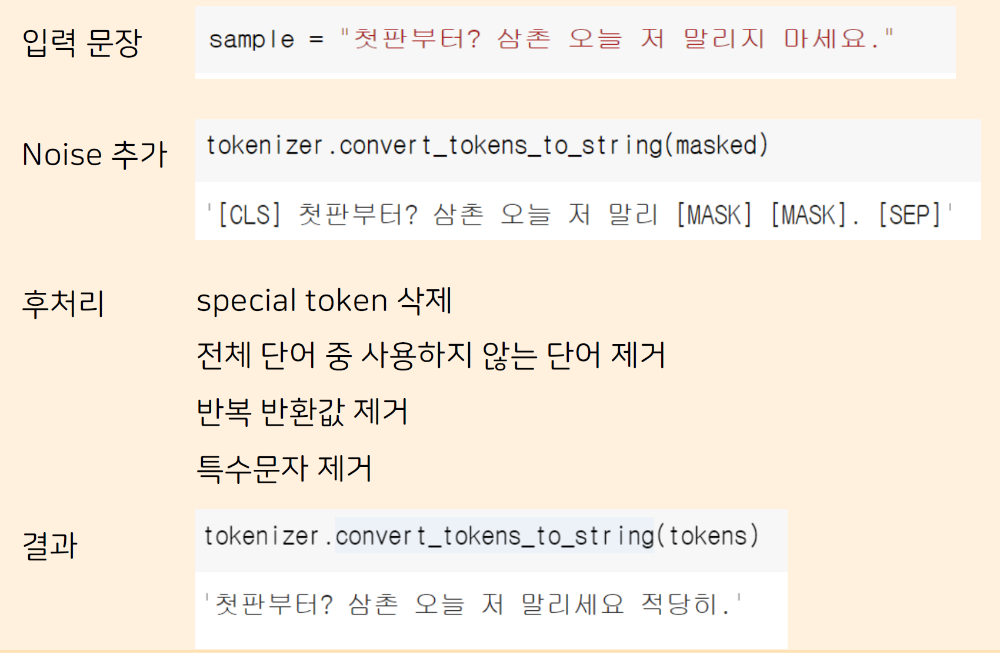

# Title

StyleLM 을 이용한 시나리오 작성

# TEAM

6기 손예진, 7기 진유리, 7기 김예진, 8기 백민준, 8기 안세정, 8기 유채원
<br> 
@TEAM 캐릭캐릭체인G


# Requirements

./run/*.ipynb 파일들을 돌릴 때 colab pro 환경에서 작업했으며,
작업별로 필요한 패키지의 경우에도 설치를 진행하기 때문에 별도로 설치할 필요는 없습니다.

다만 로컬 환경에서 가상 환경 관리를 하실 경우 사용하는 패키지는 다음과 같습니다.

```buildoutcfg
!pip install transformers
!pip install datasets
```

# Run

1. 크롤링 구현 코드
   - ./run/1.크롤링_custom.ipynb
2. 데이터 장르 라벨링
   - ./run/2.labelling.ipynb
3. 데이터 전처리
   - ./run/3.전처리_custom.ipynb
4. 모델 구현(train)
   - ./run/model_poc_B2B_customloss.ipynb
5. 모델 성능 평가(inference)
   - ./run/model_poc_B2B_customloss_result.ipynb

# Sample


모델 성능 평가 코드를 실행하면 최종 결과를 받을 수 있습니다.
다만, 해당 결과를 돌려보기 위해서 모델 파라미터가 필요하기에 필요 하신 분들은 따로 연락을 주시길 바랍니다!


# Reference

- https://colab.research.google.com/github/patrickvonplaten/notebooks/blob/master/Leveraging_Pre_trained_Checkpoints_for_Encoder_Decoder_Models.ipynb#scrollTo=cy7i1Q3D1qSI
- https://ojs.aaai.org/index.php/AAAI/article/view/6433


# Ground rule

1. 기능을 구현할 때 값들은 최대한 코드에서 제외한다.
    - EX. 파일을 "10"개 읽는 코드를 작성하기 보단 파일을 "n"개 읽는 코드를 작성하고 n이 어떤 값인지는 사용할 때 정의하도록!
        - 이렇게 하는 목적은 언제 어디에서 각 값들이 사용되는지 파악하기 위한 것!
    - 다만 사실상 상수로 사용되는 값들은 default 값으로 지정해서 사용할 수 있도록
2. 내가 쓴 코드는 다른 사람이 모른다!
    - 파일을 읽는 코드를 구현했을 때, 해당 함수를 처음보면 뭔지 알 수 없다.
    - 그렇기 때문에 다음 정보들은 알려주면 도움이 된다.
        - 입/출력값은 (개념적으로) 무엇인지
        - 입/출력값의 자료형은 무엇인지
        - 미리보기도 있다면 좋다. 
            - ndarray나 tensor는 dimension과 같은 정보를 제공
